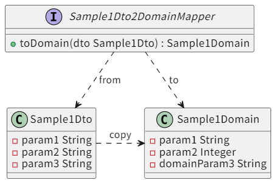
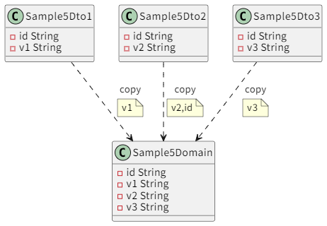
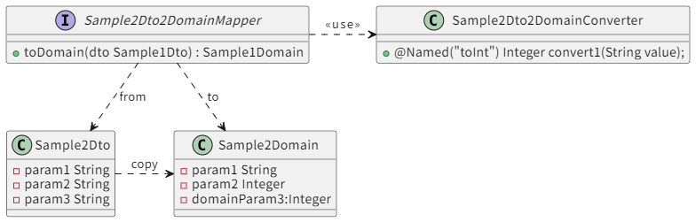

MapStructコード生成ツールの使い方。設定ファイル mappingdata.xlsx の書き方。

あらためてUsage

```console
$ npx generate-mapping --help
Options:
  --version    Show version number                                     [boolean]
  --excelPath  Excel file Path          [string] [default: "./mappingdata.xlsx"]
  --output     Output directory                   [string] [default: "./output"]
  --help       Show help                                               [boolean]
$ 
```


実行してみます。

```console
npx generate-mapping
...
INFO [2025-06-03 13:11:36.269 +0900]: output/org/example/sample6/mapper/Sample6Dto2DomainMapper.java ファイル出力完了
INFO [2025-06-03 13:11:36.271 +0900]: output/org/example/sample7/mapper/Sample7Dto2DomainMapper.java ファイル出力完了
...
$ 
```

Javaのソースコードが出力されました！


## 基本的な使い方

このインプットとなるExcelデータについて説明します。
またMapStruct自体の機能については、[MapStructSample](https://github.com/masatomix/MapStructSample/blob/main/README.md) もあわせてご参照ください。


### よく使うカラム

|項目名|必須|説明|
|--|--|--|
|``className``|必須|マッピング用クラス名を指定。FQCNで指定してください。|
|``methodName``|必須|マッピング用メソッド名を指定。|
|``fromClass``|必須|マッピング**元**クラス名を指定(FQCN)|
|``toClass``|必須|マッピング**先**クラス名を指定(FQCN)|
|``fromField``|任意|(コピー先のプロパティ名が異なる場合)<br />マッピング元プロパティ名を指定<br />同名のプロパティだけコピーすればよい場合は空でOK|
|``toField``|任意|(コピー先のプロパティ名が異なる場合)<br />マッピング先プロパティ名を指定<br />同名のプロパティだけコピーすればよい場合は空でOK|
|``active``|任意|trueの行は読み飛ばし、無視されます。<br/>デフォルトはfalseです。|


### 例

| className                                          | methodName | fromClass                            | toClass                                 | fromField | toField      |
| -------------------------------------------------- | ---------- | ------------------------------------ | --------------------------------------- | --------- | ------------ |
| org.example.sample1.mapper.Sample1Dto2DomainMapper | toDomain   | org.example.sample1.model.Sample1Dto | org.example.sample1.model.Sample1Domain | param3    | domainParam3 |

上記のようなExcelを作成し(mapping-sample1.xlsx)実行してみます。

```console
$ npx generate-mapping --excelPath mapping-sample1.xlsx 
```

> ときおり、Excelファイルにゴミ行が混入してエラーになったりします。その場合は適宜
> データ行以下の行を、行削除してみてください。

出力結果は以下の通りです。

```java
package org.example.sample1.mapper;

import org.mapstruct.Mapper;
import org.mapstruct.Mapping;
import org.mapstruct.MappingTarget;
import org.mapstruct.factory.Mappers;

import org.mapstruct.ReportingPolicy;
import org.mapstruct.BeanMapping;
import org.mapstruct.DecoratedWith;
import org.mapstruct.InheritInverseConfiguration;

@Mapper(componentModel = "spring" , unmappedTargetPolicy = ReportingPolicy.WARN  )
public interface Sample1Dto2DomainMapper {

    @Mapping(source = "param3", target = "domainParam3")
    org.example.sample1.model.Sample1Domain toDomain(org.example.sample1.model.Sample1Dto source);

    @Mapping(source = "param3", target = "domainParam3")
    void toDomainUpdate(org.example.sample1.model.Sample1Dto source, @MappingTarget org.example.sample1.model.Sample1Domain target);
}
```


- ``Sample1Dto#param3`` を ``Sample1Domain#domainParam3`` にコピーするメソッド ``toDomain``
- 引数に渡した ``Sample1Domain target``に、``Sample1Dto source`` の各プロパティを更新するメソッド ``toDomainUpdate``

をもつクラス、``Sample1Dto2DomainMapper``が作成されました。
一応ですが、プロパティ名が一致している場合は、それらもコピーされます。

 クラス図にすると以下のとおりです。




#### 名前が異なるプロパティが複数ある場合


| className                                          | methodName | fromClass                            | toClass                                 | fromField | toField |
| -------------------------------------------------- | ---------- | ------------------------------------ | --------------------------------------- | --------- | ------- |
| org.example.sample1.mapper.Sample1Dto2DomainMapper | toDomain   | org.example.sample1.model.Sample1Dto | org.example.sample1.model.Sample1Domain | from1     | to1     |
| org.example.sample1.mapper.Sample1Dto2DomainMapper | toDomain   | org.example.sample1.model.Sample1Dto | org.example.sample1.model.Sample1Domain | from2     | to2     |

のように「``className,methodName,fromClass,toClass``」を繰り返し記述してください。


```java
package org.example.sample1.mapper;

@Mapper(componentModel = "spring" , unmappedTargetPolicy = ReportingPolicy.WARN  )
public interface Sample1Dto2DomainMapper {

    @Mapping(source = "from1", target = "to1")
    @Mapping(source = "from2", target = "to2")
    org.example.sample1.model.Sample1Domain toDomain(org.example.sample1.model.Sample1Dto source);

    ... 省略
}
```

となります。
MapStructの最低限の機能を使う場合は、概ねこれでOKです！

### 注意

> 同名のメソッドについて、このUtilityは ``className,methodName,fromClass,toClass``をキー項目として処理します。それは
>
> ``void toDomainUpdate(Sample1Dto source, @MappingTarget Sample1Domain target)``
>
> このxxUpdate メソッドのキー項目が「メソッド名、引数1、引数2」となるためですが、その都合上
>
> ```
> Sample1Domain1 toDomain(Sample1Dto source)
> Sample1Domain2 toDomain(Sample1Dto source)
> ```
> などのメソッドが定義・出力できてしまいます(**Javaは同じメソッド名・引数で、別の戻り値は定義できない**)。
> これらの変換メソッドを定義したい場合は、メソッド名を変更するなど、適宜工夫をしてください。


## 応用

### 除外したいプロパティを指定する

| 項目名(任意指定) | 説明                                   | 備考                                 |
| ---------------------- | -------------------------------------- | -------------------------------------- |
| ignoreColumn           | コピーから除外したいプロパティ名を指定 | プロパティ単位で記述 |


使用例:


| className                                          | methodName | fromClass                             | toClass                                 | fromField | toField | ignoreColumn |
| -------------------------------------------------- | ---------- | ------------------------------------- | --------------------------------------- | --------- | ------- | ------------ |
| org.example.sample5.mapper.Sample5Dto2DomainMapper | toDomain   | org.example.sample5.model.Sample5Dto3 | org.example.sample5.model.Sample5Domain |           |         | id           |
| org.example.sample5.mapper.Sample5Dto2DomainMapper | toDomain   | org.example.sample5.model.Sample5Dto3 | org.example.sample5.model.Sample5Domain |           |         | v1           |
| org.example.sample5.mapper.Sample5Dto2DomainMapper | toDomain   | org.example.sample5.model.Sample5Dto3 | org.example.sample5.model.Sample5Domain |           |         | v2           |
| org.example.sample5.mapper.Sample5Dto2DomainMapper | toDomain   | org.example.sample5.model.Sample5Dto3 | org.example.sample5.model.Sample5Domain | v3        | v3      |              |

実行結果(適宜整形しています)


```java

package org.example.sample5.mapper;


@Mapper(componentModel = "spring" , unmappedTargetPolicy = ReportingPolicy.WARN  )
public interface Sample5Dto2DomainMapper {

    @Mapping(target = "id" , ignore = true)
    @Mapping(target = "v1" , ignore = true)
    @Mapping(target = "v2" , ignore = true)
    @Mapping(source = "v3", target = "v3")
    Sample5Domain toDomain(Sample5Dto3 source);


    @Mapping(target = "id" , ignore = true)
    @Mapping(target = "v1" , ignore = true)
    @Mapping(target = "v2" , ignore = true)
    @Mapping(source = "v3", target = "v3")
    void toDomainUpdate(Sample5Dto3 source, @MappingTarget Sample5Domain target);

}
```

参考: [Sample5: 複数のオブジェクトから一つのオブジェクトを作成する](https://github.com/masatomix/MapStructSample?tab=readme-ov-file#sample5-%E8%A4%87%E6%95%B0%E3%81%AE%E3%82%AA%E3%83%96%E3%82%B8%E3%82%A7%E3%82%AF%E3%83%88%E3%81%8B%E3%82%89%E4%B8%80%E3%81%A4%E3%81%AE%E3%82%AA%E3%83%96%E3%82%B8%E3%82%A7%E3%82%AF%E3%83%88%E3%82%92%E4%BD%9C%E6%88%90%E3%81%99%E3%82%8B)




### usesとqualifiedByName で、カスタム変換メソッドを使う


| 項目名(いずれも任意指定) | 説明                                   | 備考                                 |
| ---------------------- | -------------------------------------- | -------------------------------------- |
| uses                   | このインタフェースが使用する別クラスを指定します(FQCN)。<br />ようするに``uses = { org.example.Sample2Dto2DomainConverter.class,  }``を出力します。<br />複数指定したい場合はカンマ区切りもしくはAlt+Enter区切りで指定可能です。.classは不要なのでご注意。 | クラス単位で記述<br />(クラスごとの先頭行を参照します) |
| qualifiedByName        | 該当プロパティにカスタム変換名``qualifiedByName`` を記述。<br />よするに、``qualifiedByName = "xxx"`` を出力します。| プロパティ単位で記述 |


使用例:

| className                                          | methodName | fromClass                            | toClass                                 | fromField | toField      | qualifiedByName | uses                                   |
| -------------------------------------------------- | ---------- | ------------------------------------ | --------------------------------------- | --------- | ------------ | --------------- | -------------------------------------- |
| org.example.sample2.mapper.Sample2Dto2DomainMapper | toDomain   | org.example.sample2.model.Sample2Dto | org.example.sample2.model.Sample2Domain | param3    | domainParam3 | toInt           | org.example.Sample2Dto2DomainConverter |

実行結果(適宜整形しています)


```java
package org.example.sample2.mapper;


@Mapper(componentModel = "spring" , unmappedTargetPolicy = ReportingPolicy.WARN , 
uses = { Sample2Dto2DomainConverter.class,  } )
public interface Sample2Dto2DomainMapper {

    @Mapping(source = "param3", target = "domainParam3" ,qualifiedByName = "toInt")
    Sample2Domain toDomain(Sample2Dto source);

    ...省略

}
```

あたりまえですが、Converterクラスはあらかじめ手動で用意しておきましょう。

参考: [Sample2: 個別の変換ロジックを挟みたい](https://github.com/masatomix/MapStructSample?tab=readme-ov-file#sample2-%E5%80%8B%E5%88%A5%E3%81%AE%E5%A4%89%E6%8F%9B%E3%83%AD%E3%82%B8%E3%83%83%E3%82%AF%E3%82%92%E6%8C%9F%E3%81%BF%E3%81%9F%E3%81%84)




### ignoreByDefault でデフォルトのコピーをOFFにする


| 項目名(任意指定) | 説明                                   | 備考                                 |
| ---------------------- | -------------------------------------- | -------------------------------------- |
| ignoreByDefault | TRUEにしたメソッドは<br />``@BeanMapping(ignoreByDefault = true)``が出力されます。名前一致時の自動コピーがOFFになります。 | メソッド単位で記述<br />(メソッドごとの先頭行を参照します) |


### decorator を使って別クラスで処理をDecorateする


| 項目名(任意指定) | 説明                                   | 備考                                 |
| ---------------------- | -------------------------------------- | -------------------------------------- |
| decorator | DecoratorとなるクラスをFQCNで指定します。<br />``@DecoratedWith(xxxx.class)``がクラス単位で出力されます。 | クラス単位で記述<br />(クラスごとの先頭行を参照します) |


### inverse で逆コピーのメソッドを出力する

| 項目名(任意指定) | 説明                                   | 備考                                 |
| ---------------------- | -------------------------------------- | -------------------------------------- |
| inverse | TRUEにしたメソッドは<br />``@InheritInverseConfiguration``が付けられた逆コピーメソッドが出力されます。<br />(@InheritInverseConfigurationの機能自体がどれくらい実用的かは未検証ですが) | メソッド単位で記述<br />(メソッドごとの先頭行を参照します) |


以上